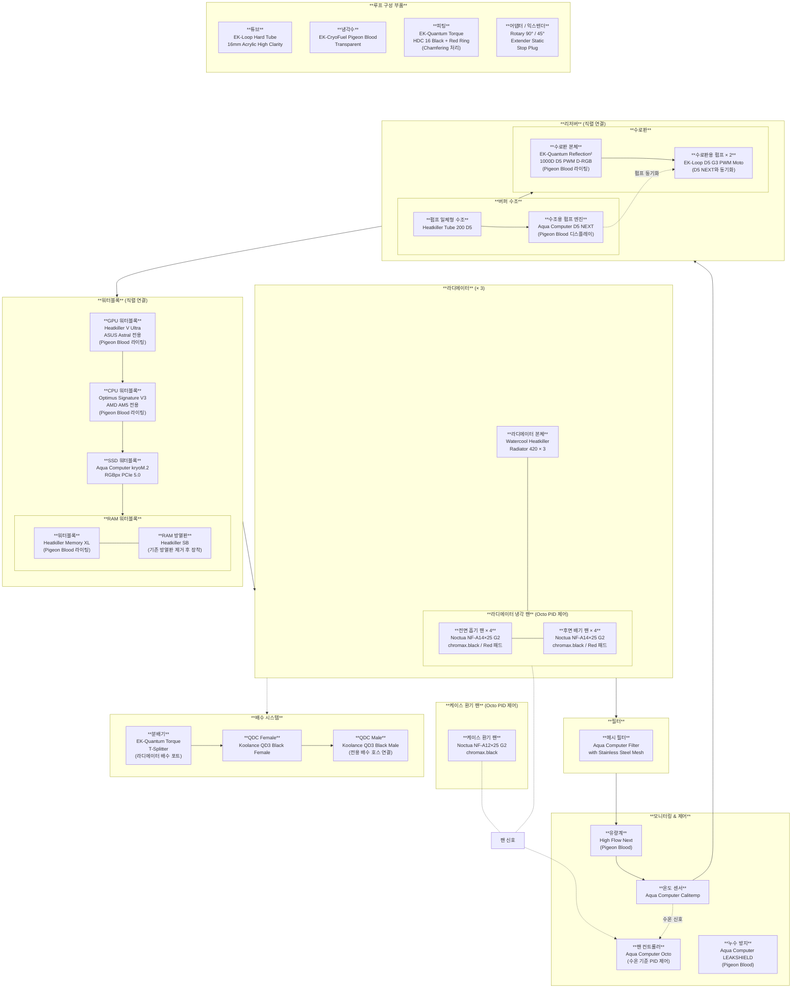
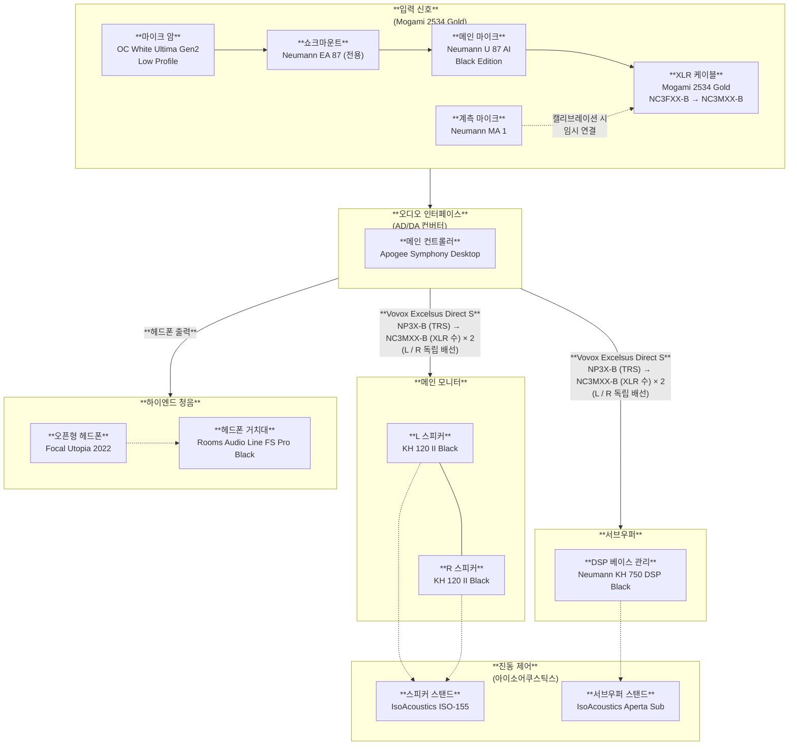

# RPK3CT

---

```table-of-contents
```

> [!IDEA] 개요
> **RUBIDIAN DESKTOP**은 **RUBIDIAN PROJECT**의 중심이 되는 기기로서, 타협없는 강력한 하드웨어, 그리고 완벽하게 통제된 워크플로우를 지향하는 마스터피스급 시스템이다. **RUBIDIAN DESKTOP**의 역할은 **RUBIDIAN HOME LAB** 내부에서의 메인 작업 및 모든 프로젝트의 최종 작업이다.

## HARDWARE

---

### DEVICE

---

#### CORE

---

|   제품군    |                    모델                    |        비고         |
| :------: | :--------------------------------------: | :---------------: |
| **CPU**  |           AMD Ryzen 9 9950 X3D           |         -         |
| **GPU**  |    NVIDIA GeForce RTX 5090 32GB GDDR7    | ASUS Astral OC 버전 |
| **RAM**  | G.Skill Trident Z5 Neo F5-6000J3036G48X2 |  Hynix A-die 선별   |
| **SSD**  |    Samsung 9100 Pro PCIe 5.0 NVME 2.0    |     2TB & 8TB     |
| **메인보드** |       ASUS CROSSHAIR X870E EXTREME       |         -         |

##### DETAILS

---

**CPU**

- **BIOS**
  - PBO Mode → Advanced
  - Curve Optimizer → Negative \[-15 ~ -20]
  - PBO Limits → Motherboard
  - L3 Cache Priortization → Auto
  - Medium Load Booster → Enabled
  - Max CPU Boost Clock Override → Enabled (Positive) \[+150 ~ +200]
- **Windows 제어판**
  - 전원 관리 옵션 → 최고의 성능 \[`powercfg -duplicatescheme e9a42b02-d5df-448d-aa00-03f14749eb61`]

---

**GPU**

- **Physical**
  - Dual BIOS Switch → P-Mode
- **BIOS**
  - Re-Size BAR → Enabled
  - PCIe Link Speed Enforcement → Fix Gen 5
  - Interrupt Steering → Auto
- **ASUS GPU Tweak III**
  - Power Target → 110% ~ 120%
  - GPU Boost Clock → +50MHz ~ +100MHz
  - Memory Clock → +300MHz ~ +500MHz
- **MSI Mode Utility**
  - Interrupt Mode → MSI
  - Interrupt Priority → High
- **NVIDIA 제어판**
  - 안티앨리어싱 → 응용 프로그램 제어
  - 이방성 필터링 → 응용 프로그램 제어
  - 전원 관리 모드 → 최고 성능 선호
  - 저지연 모드 → 울트라
- **Windows 설정**
  - 하드웨어 가속 GPU 일정 예약 → Enabled

---

**RAM**

- **BIOS**
  - Ai Overclock Tuner → EXPO Tweaked
  - DRAM Frequency → 6000MHz
  - UCLK DIV1 MODE → \[UCLK=MCLK (1:1)]
  - Memory Context Restore → Enabled
  - Fixed SoC Voltage → Fixed \[1.20V ~ 1.25V]
  - Power Down Mode → Disabled
  - DRAM Performance Mode → Performance Mode
  - TCL → 30
  - TRCD → 36
  - TRP → 36
  - TRAS → 30 ~ 48
  - TREFI → 65535

---

**SSD**

- **Physical**
  - RAID → No RAID \[2TB → System & Program Setup | 8TB → User Data & Data Save]
- **BIOS**
  - PCIe Bandwidth Configuration → Fix Gen 5
  - NVMe RAID Mode → Disabled
  - ASPM → Disabled
  - APST → Disabled
  - L1 Substates → Disabled
  - M.2 Link Power Management → Disabled
- **Samsung Magician**
  - Full Power Mode → Enabled
  - Write-Cache Buffering → Enabled
  - Over-Provisioning (Only 8TB) → 5%~10%

---

**메인보드**

- **Slot**
  - PCIeX16\_1 ← GPU
  - PCIeX16\_2 ← Fiber Optic NIC
  - PCIe 4.0 x4 ← Thunderbolt Add-in Card
  - M.2\_1 ← 2TB SSD
  - M.2\_2 ← 8TB SSD

#### COOLING

---

|          제품군          |                       모델                       |     수량     |                                                비고                                                |
| :-------------------: | :--------------------------------------------: | :--------: | :----------------------------------------------------------------------------------------------: |
|       **라디에이터**       |       Watercool Heatkiller Radiator 420        |     3      |              Noctua NF-A14 팬 양면 구성 (전면 4개 + 후면 4개)<br>Octo 컨트롤러와 연결하여 수온 기준 PID 제어               |
|         **팬**         |   Noctua NF-A14×25 G2 | Noctua NF-A12×25 G2   |   17 + 1   |                           chromax.black 색상<br>팬 모서리 방진 패드를 Red 컬러로 교체                            |
|      **팬 컨트롤러**       |               Aqua Computer Octo               |     1      |                                                -                                                 |
|     **수조용 펌프 엔진**     |             Aqua Computer D5 NEXT              |     1      |             Pigeon Blood 디스플레이 색상<br>Heatkiller Tube 수조에 장착<br>EK-Loop D5 G3 펌프와 동기화             |
|      **수로판용 펌프**      |             EK-Loop D5 G3 PWM Moto             |     2      |                        Reflection² 1000D 펌프에 2개 장착<br>D5 NEXT 펌프 엔진과 동기화                         |
|     **펌프 일체형 수조**     |        Watercool Heatkiller Tube 200 D5        |     1      |                             Reflection² 1000D 수로판과 직렬 연결하여 버퍼 수조로 사용                             |
|        **수로판**        |   EK-Quantom Reflection² 1000D D5 PWM D-RGB    |     1      |                                      Pigeon Blood 톤 라이팅 색상                                       |
|        **유량계**        |          Aqua Computer High Flow Next          |     1      |                                      Pigeon Blood 톤 라이팅 색상                                       |
|       **온도 센서**       |             Aqua Computer Calitemp             |     4      |                수로판, 라디에이터 출구에 제어용 설치<br>버퍼 수조 밑, 라디에이터 입구, GPU 워터블록 직후에 모니터링용 설치                 |
|     **누수 방지 장치**      |            Aqua Computer LEAKSHIELD            |     1      |                                      Pigeon Blood 디스플레이 색상                                       |
|     **GPU 워터블록**      |          Watercool Heatkiller V Ultra          |     1      |                          ASUS Astral GPU 전용 모델<br>Pigeon Blood 톤 라이팅 색상                          |
|     **CPU 워터블록**      |              Optimus Signature V3              |     1      |                            AMD AM5 소켓 전용 모델<br>Pigeon Blood 톤 라이팅 색상                             |
|     **SSD 워터블록**      |      Aqua Computer kryoM.2 RGBpx PCIe 5.0      |     1      |                                        표면 니켈 도금 고속 구리 베이스                                        |
|     **RAM 워터블록**      |         Watercool Heatkiller Memory XL         |     1      |                                Black 색상<br>Pigeon Blood 톤 라이팅 색상                                 |
|   **워터블록용 RAM 방열판**   |            Watercool Heatkiller SB             |     1      |                                          기존 방열판 제거 후 장착                                          |
|        **튜브**         |   EK-Loop Hard Tube 16mm Acryic High Clarity   |     8      |                                                -                                                 |
|        **냉각수**        |              Mayhems XT-1 Nuke V2              | 4L ~ 5L 분량 | Transparent Blood Red Color Base<br>Violet Color Tone Down<br>Extreme Minimal Black Color Option |
|        **필터**         | Aqua Computer Filter with Stainless Steel Mesh |     1      |                                                -                                                 |
|   **하드라인 컴프레션 피팅**    |      EK-Quantum Torque HDC 16 Satin Black      |     36     |                                          Chamfering 진행                                           |
|     **피팅 커스텀 링**      |       EK-Quantom Torque Color Rings Red        |     4      |                                                -                                                 |
|      **로터리 어댑터**      |      EK-Quantum Torque Rotary 90° | 45°       |  20 + 10   |                                                -                                                 |
|       **익스탠더**        |       EK-Quantum Torque Extender Static        |     18     |                             MF 7: 6<br>MF 14: 6<br>MF 28: 4<br>MM: 2                             |
|      **스톱 플러그**       |             EK-Quantum Torque Plug             |     20     |                                                -                                                 |
|        **분배기**        |          EK-Quantum Torque T-Splitter          |     1      |                라디에이터 배수용 포트에 장착<br>T-Splitter 한쪽 구멍에 Koolance QD3 Famaile QDC 장착                 |
| **QDC (퀵 디스커넥트 커플러)** |        Koolance QD3 Black Famale / Male        |     1      |                                 Male에 짧은 호스를 연결해 배수 목적 전용 호스로 사용                                 |
|                       |                                                |            |                                                                                                  |

##### FLOWCHART

---



#### BASE

---

|        제품군        |                    모델                     |                                                                   비고                                                                    |
| :---------------: | :---------------------------------------: | :-------------------------------------------------------------------------------------------------------------------------------------: |
|    **PC 케이스**     |          Corsair Obsidian 1000D           | 상단 배기 / 전면 흡기 / 하단 흡기에 Heatkiller Radiator 장착<br>배수 밸브를 라디에이터로 직결하지 않고 어댑터와 연장관을 해 케이스 하단 전면으로 QDC를 연결<br>바닥면에 Black Mirror 색감 아크릴 판 부착 |
|      **PSU**      |          Seasonic PRIME TX-1600           |                                                      chromax.black Noctua Edition                                                       |
|      **UPS**      |          APC Smart-UPS SMT2200IC          |                                                                    -                                                                    |
|    **서지 보호기**     | APC Performance SurgeArrest PM8-KR 2700J+ |                                                                    -                                                                    |
| **UPS 출력 변환 멀티탭** |              Netmate NM-P06               |                                                                    -                                                                    |
| **UPS용 고하중 거치대**  |       Bytesium L-Series Heavy Duty        |                                                                    -                                                                    |
|    **전원 컨디셔너**    |            Furman PL-PRO DMC E            |                                                                    -                                                                    |
|   **내부 USB 헤더**   |           Aqua Computer Hubby 7           |                                                                    -                                                                    |
|    **전원 케이블**     |  CableMod PRO ModMesh Custom PSU Cables   |          Blood Red & Black Color<br>Center Accent Pattern<br>Aluminum Pro Combs (Black)<br>Closed Combs<br>90 Degree Variant B          |

### GEAR

---

#### INPUT

---

|       제품군       |             모델              |                                  비고                                  |
| :-------------: | :-------------------------: | :------------------------------------------------------------------: |
|   **작업용 키보드**   |   Topre RealForce R4HB11    |                                  -                                   |
|   **게이밍 키보드**   |        Wooting 80HE         |                           Zinc Alloy Black                           |
| **키보드용 손목 받침대** |     HyperX Wrist Rest L     | 작업용 / 게이밍 키보드에서 모두 사용<br>Rapid TKL 사용 시 오른쪽 끝을 맞춰 마우스 공간을 침범하지 않고 사용 |
|   **작업용 마우스**   |    Logitech MX Master 4     |                                  -                                   |
| **다목적 게이밍 마우스** |  Razer Basilisk V3 Pro 35K  |                                  -                                   |
| **경쟁전 게이밍 마우스** |     Razer VIper V4 Pro      |                                  -                                   |
|   **마우스 패드**    | Artisan Hayate Otsu Soft XL |                                  -                                   |
| **마우스용 손목 받침대** |   Delta Hub Carpio G2.0 L   |                                  -                                   |
|   **매크로 장치**    |  Elgato Stream Deck+ Black  |                             매크로 / 단축키 제어                             |
|  **작업 제어 장치**   |        Loupedeck CT         |                             다이얼 기반 정밀 제어                             |
|     **웹캠**      |     Elgato Facecam Pro      |                                  -                                   |
|   **웹캡 마운트**    |    Elgato Master Mount L    |                                  -                                   |

#### GRAPHIC

---

|       제품군       |                        모델                        |                  비고                  |
| :-------------: | :----------------------------------------------: | :----------------------------------: |
|   **피벗 모니터**    |                   BenQ PD2705Q                   | 최좌측 거치<br>문서 작업, 프로그래밍, 웹 열람, 세로 영상용 |
|   **서브 모니터**    |           ASUS ROG Swift OLED PG32UCDM           |     좌측 거치<br>서브 작업, 미디어 관람 / 시청용     |
|   **메인 모니터**    |            LG UltraGear OLED 32GS95UE            |         중앙 거치<br>메인 작업, 게이밍용         |
|   **특수 모니터**    |    Dell UltraSharp HDR Premier Color UP3221Q     |       우측 거치<br>색상 보정, 미디어 편집용        |
|    **모니터 암**    |           Humanscale M10 Single Black            |           개별 모니터 당 1개씩 구비            |
| **하드웨어 캘리브레이터** |            Calibrite Display Plus HL             |        Dell UltraSharp 기준 보정         |
|  **앰비언트 라이트**   | Philips Hue Play Gradient Lightstrip | Sync Box |        Pigeon Blood 톤 라이팅 색상         |

#### AUDIO

---

|      제품군      |                           모델                            |                       비고                        |
| :-----------: | :-----------------------------------------------------: | :---------------------------------------------: |
| **오디오 인터페이스** |                 Apogee Symphony Desktop                 |                        -                        |
|    **스피커**    |                 Neumann KH 120 II Black                 |         Pigeon Blood Highlighting Logo          |
| **진동 방지 스탠드** |                  IsoAcoustics ISO-155                   |                        -                        |
|   **서브우퍼**    |                Neumann KH 750 DSP Black                 |                        -                        |
| **서브우퍼 스탠드**  |                 IsoAcoustics Aperta Sub                 |                        -                        |
| **계측 전용 마이크** |                      Neumann MA 1                       |                        -                        |
|    **헤드셋**    |                    Focal Utopia 2022                    |                        -                        |
|  **헤드셋 거치대**  |              Rooms Audio Line FS Pro Black              |                        -                        |
|    **마이크**    |              Neumann U 87 AI Black Edition              |               내부 동봉된 전용 쇼크마운트 사용                |
|   **마이크 암**   |            OC White Ultima Gen2 Low Profile             |                        -                        |
|  **입력 케이블**   |                    Mogami 2534 Gold                     |                     XLR 암-수                     |
|  **출력 케이블**   |                 Vovox Excelsus Direct S                 |                        -                        |
|  **스피커 플러그**  | Neutrik NP3X-B (TRS 5.5파이) / Neutrik NC3MXX-B (XLR 금도금) |            Symphony Desktop → KH 120            |
| **서브우퍼 플러그**  |     Neutrik NP3X-B (TRS) / Neutrik NC3MXX-B (XLR 수)     |            Symphony Desktop → KH 750            |
|    **커넥터**    | Neutrik NP3X-B | Neutrik NC3MXX-B | Neutrik NC3FXX-B  | Symphony Desktop, KH 750 / 120, KH 750 → KH 120 |

##### FLORCHART

---



#### MISC

---

|          제품군          |                     모델                      |                     비고                     |
| :-------------------: | :-----------------------------------------: | :----------------------------------------: |
|        **프린터**        |          Epson EcoTank Pro ET-5850          |                     -                      |
|       **광랜 모듈**       |          Intel 10G SFP+ SR Module           |                  DDM 모니터링                  |
|       **광케이블**        | OM4 LC-LC Duplex Multimode Red Color Jacket |                     -                      |
| **Thunderbolt 확장 카드** |            ASUS ThunderboltEX 4             |                     -                      |
|      **USB 허브**       |                CalDigit TS4                 |           Thunderbolt Station 4            |
|      **케이블 슬리브**      |                 MDPC-X XTC                  | Heatshrinkless 마감<br>Red Carbon 포인트 슬리브 색상 |

#### FURNITURE

---

|  제품군   |                모델                 |         비고          |
| :----: | :-------------------------------: | :-----------------: |
| **의자** | Herman Miller Embody Gaming Chair |          -          |
| **책상** |       Secretlab MAGNUS Pro        | Dark Knight Edition |

## SOFTWARE

---

### SYTEM / DRIVER & CONTROL

---

|         분류군          |                    소프트웨어                     |    라이선스     |      패키지 원본       |    비고     |
| :------------------: | :------------------------------------------: | :---------: | :---------------: | :-------: |
|       **운영체제**       |             Microsoft Windows 11             | Windows Pro |     Setup USB     |     -     |
|     **칩셋 드라이버**      |     AMD X870E AM5 Chipset Driver Package     |      -      | Official Homepage |     -     |
|     **그래픽 드라이버**     |           NVIDIA Game Ready Driver           |      -      | Official Homepage |     -     |
|      **GPU 제어**      |      NVIDIA App<br>NVIDIA Control Panel      |      -      | Official Homepage |     -     |
|                      |              ASUS GPU Tweak III              |      -      | Official Homepage |     -     |
|                      |               MSI Mode Utility               |      -      | Official Homepage |     -     |
|     **사운드 드라이버**     |     Realtek High Definition Audio Driver     |      -      | Official Homepage |     -     |
|                      |       Neumann Control<br>Neumann MA 1        |      -      | Official Homepage |     -     |
|                      |          Apogee Control 2 Software           |      -      | Official Homepage |     -     |
|   **유선 네트워크 드라이버**   |                Intel 10G LAN                 |      -      | Official Homepage |     -     |
|   **무선 네트워크 드라이버**   | Intel Wi-Fi Driver | Intel Bluetooth Driver |      -      | Official Homepage |     -     |
|  **HID 드라이버 및 제어**   |              RealForce Connect               |      -      | Official Homepage |     -     |
|                      |                  Wootility                   |      -      | Official Homepage |     -     |
|                      |                 Logi Option+                 |      -      | Official Homepage |     -     |
|                      |       Razer Synapse 4<br>Razer Chroma        |      -      | Official Homepage |     -     |
|                      |          ASUS DisplayWidget Center           |      -      | Official Homepage |     -     |
|   **매크로 및 작업 제어**    |       Elgato Stream Deck Software<br>        |      -      | Official Homepage |     -     |
|                      |              Loupedeck Software              |      -      | Official Homepage |     -     |
| **수랭 시스템 제어 및 모니터링** |            Aqua Coputer Aquasuite            |      -      | Official Homepage | RGB 제어 전권 |
|    **오버클럭 모니터링**     |              ASUS Armoury Crate              |      -      | Official Homepage |     -     |
|     **프린터 드라이버**     |              Epson EcoTank Pro               |      -      | Official Homepage |     -     |
|    **NVMe 드라이버**     |        Samsung Magician & NVMe Driver        |      -      | Official Homepage |     -     |

### SECURITY / PRIVACY & DATA PROTECTION

---

|         분류군         |             소프트웨어              |            라이선스            |      패키지 원본       |                                                          비고                                                          |
| :-----------------: | :----------------------------: | :------------------------: | :---------------: | :------------------------------------------------------------------------------------------------------------------: |
|  **안티 바이러스 소프트웨어**  |       ESET Home Security       | ESET Home Security Premium |      Winget       |                                       AppCheck 상호 예외 설정<br>WebProtection 비활성화                                        |
|  **안티 랜섬웨어 소프트웨어**  |       CheckMAL AppCheck        |        AppCheck Pro        |      Winget       |                                                    ESET 상호 예외 설정                                                     |
|  **네트워크 보안 소프트웨어**  |         ESET Firewall          | ESET Home Security Premium |      Module       |                                                       ESET 내장                                                        |
|  **네트워크 관제 소프트웨어**  |      SecureMix GlassWire       |     GlassWire Premium      |       Scoop       |                                                     방화벽 기능 비활성화                                                      |
|    **칩입 탐지 시스템**    | ESET Network Attack Protection | ESET Home Security Premium |      Module       |                                                       ESET 내장                                                        |
| **설치형 악성 코드 제거 도구** |          Malwarebytes          |    Malwarebytes Premium    |      Winget       |                                             실시간 보호 비활성화<br>주 1회 자동 전체 검사                                             |
| **포터블 악성 코드 제거 도구** |          Malware Zero          |             -              | Official Homepage |                                                    감염 의심 시 수동 검사                                                     |
|   **블로트웨어 소거 도구**   |             구라제거기              |             -              | Official Homepage |                                                 블로트웨어 설치 의심 시 수동 실행                                                  |
|     **VPN 서비스**     |           ProtonVPN            |       ProtonVPN Plus       |      Winget       | WireGuard UDP 프로토콜<br>Kill Switch Non-Permanent 활성화<br>NetShield 비활성화<br>VPN Accelerator 활성화<br>일부 VPN 차단 사이트 분할 터널링 |
|    **비밀번호 관리자**     |           Bitwarden            |             -              |       Scoop       |                                             Vaultwarden NAS Self-hosting                                             |
|     **컨텐츠 차단기**     |            AdGuard             |      AdGuard Familys       |      Winget       |                WFP 드라이버 모드 기능 사용<br>HTTPS 필터링 활성화<br>EV 인증서 웹사이트 필터링 활성화<br>AdGuard DNS-over-QUIC 사용                 |
|    **클라우드 아카이브**    |             IDrive             |   IDrive Personal 100TB    |      Winget       |                                                       분기 1회 백업                                                       |

### WORKSPACE / OFFICE

---

|      분류군      |           소프트웨어           |             라이선스              |      패키지 원본       |                   비고                    |
| :-----------: | :-----------------------: | :---------------------------: | :---------------: | :-------------------------------------: |
|  **워드프로세서**   |    Microsoft Word 2026    |     Microsoft 365 Premium     | Official Homepage |                    -                    |
|               |    Hancom Hangul 2024     |          Hancom Docs          |     Homepage      |                    -                    |
|  **프레젠테이션**   | Microsoft PowerPoint 2026 |     Microsoft 365 Premium     | Official Homepage |                    -                    |
|  **스프레드시트**   |   Microsoft Excel 2026    |     Microsoft 365 Premium     | Official Homepage |                    -                    |
|  **PDF 리더**   |     Adobe Acrobat Pro     | Adobe Creative Cloud All Apps | Official Homepage |                    -                    |
|   **간편 메모**   |        Google Keep        |        Google AI Ultra        |    Vivaldi PWA    |                    -                    |
|  **협업 프로젝트**  |          Notion           |          Notion Plus          |       Scoop       |                    -                    |
| **메일 클라이언트**  |          Outlook          |     Microsoft 365 Premium     | Official Homepage |                    -                    |
| **클라우드 스토리지** |          DropBox          |    DropBox Essentials 3TB     |       Scoop       | 파일 공유 & 동기화, 오피스 작업용<br>파일 저장 및 백업은 NAS |
|               |       Google Drive        |        Google AI Ultra        |      Winget       |   갤러리 동기화, 외부 협업용<br>미디어는 NAS에 추가 백업    |
|  **AI 서비스**   |          ChatGPT          |          ChatGPT Pro          |      Winget       |                    -                    |
|               |          Claude           |          Claude Max           |       Scoop       |                    -                    |
|               |          Gemini           |        Google AI Ultra        |    Vivaldi PWA    |                    -                    |

### CREATIVE / STUDIO

---

|          분류군           |       소프트웨어        |             라이선스              |      패키지 원본       |                 비고                 |
| :--------------------: | :----------------: | :---------------------------: | :---------------: | :--------------------------------: |
|     **데스크탑 퍼블리싱**      |   Adobe InDesign   | Adobe Creative Cloud All Apps | Official Homepage |                 -                  |
|     **비트맵 그래픽 툴**      |  Adobe Photoshop   | Adobe Creative Cloud All Apps | Official Homepage |                 -                  |
|      **벡터 그래픽 툴**      | Adobe Illustrator  | Adobe Creative Cloud All Apps | Official Homepage |                 -                  |
|      **3D 그래픽 툴**      |      Blender       |               -               |       Scoop       |               -<br>-               |
|                        |       ZBrush       |      <br>ZBrush Personal      |      Winget       |                 -                  |
| **영상 편집 / 영상 색상 보정 툴** |  DaVinci Resolve   |    DaVinci Resolve Studio     |      Winget       | XML/EDL 내보내기를 통한 Adobe CC와의 작업물 공유 |
|      **음향 편집 툴**       |   Adobe Audition   | Adobe Creative Cloud All Apps | Official Homepage |                 -                  |
|   **특수 효과 / 모션 그래픽**   | Adobe After Effect | Adobe Creative Cloud All Apps | Official Homepage |                 -                  |
|     **사진 색상 보정 툴**     |  Adobe Lightroom   | Adobe Creative Cloud All Apps | Official Homepage |                 -                  |

### DEV STACK / EDITOR

---

|       분류군        |              소프트웨어               |            라이선스             |      패키지 원본       |                                                                                             비고                                                                                             |
| :--------------: | :------------------------------: | :-------------------------: | :---------------: | :----------------------------------------------------------------------------------------------------------------------------------------------------------------------------------------: |
|    **단순 메모장**    |             Notepads             |              -              |       Scoop       |                                                                                             -                                                                                              |
|   **마크다운 편집기**   |              Typora              |         Typora EULA         |       Scoop       |                                                                              단일 파일 마크다운 파일 편집 및 텍스트 기반 문서 작업                                                                               |
| **개인 지식 관리 시스템** |             Obsidian             |              -              |       Scoop       | 지식 관리 시스템 구축<br>Self-hosted Live Sync Plugin를 통해 NAS Container 동기화<br>Quartz & Quartz Syncer Plugin과 GitHub & Vercel 를 통해 정적 웹 게시<br>Obsidian-Remote NAS Container Package를 통해 외부 환경 웹 액세스 |
|   **텍스트 편집기**    |            Notepad++             |              -              |       Scoop       |                                                                                 대용량 텍스트 파일 분석 및 단순 텍스트 수정                                                                                  |
|    **코드 에디터**    |        Visual Studio Code        |              -              |       Scoop       |                                                               LaTeX 편집 (LaTeX Workshop Extension)<br>포맷팅 및 스크립팅<br>SSH 원격 접속                                                               |
|   **통합 개발 환경**   |        Visual Studio IDE         | Visual Studio Professional  |      Winget       |                                                            ReSharper C++ Plugin<br> C / C++ | Windows App | Native Programing                                                            |
|                  |         JetBrains Rider          | JetBrains All Products Pack | JetBrains Toolbox |                                                                           C# / F# | Game Engine | .NET Backend                                                                           |
|                  |       JetBrains RustRover        | JetBrains All Products Pack | JetBrains Toolbox |                                                                       Pure Rust | Rust Backend | System Programing                                                                       |
|                  | JetBrains IntelliJ IDEA Ultimate | JetBrains All Products Pack | JetBrains Toolbox |                              Java / Kotlin | JVM Backend <br>Pure Python | Python Backend | Data Analysis | AI Model Training<br>JS / TS | Web Frontend                               |
|   **LaTeX 엔진**   |             TeX Live             |              -              |       Scoop       |                                                                                             -                                                                                              |
|  **데이터베이스 관리**   |             Navicat              |       Navicat Premium       |       Scoop       |                                                                                         종합 설계 및 관리                                                                                         |
|                  |    JetBrains IDE 내장 DataGrip     | JetBrains All Products Pack |      Module       |                                                                                       개발 단계 조회 및 확인                                                                                        |
|   **버전 관리 엔진**   |               Git                |              -              |       Scoop       |                                                                                             -                                                                                              |
| **버전 관리 클라이언트**  |            GitKraken             |        GitKraken Pro        |       Scoop       |                                                                                     메인 레포지토리 / 브랜치 관리                                                                                      |
|                  |     IDE 내장 및 VS Code 확장 Git      |              -              |      Module       |                                                                                   단순 커밋 / 푸시 및 수정 이력 확인                                                                                    |

### UTILITY / EXTENTION

---

|        분류군        |          소프트웨어          |              라이선스              |   패키지 원본    |                            비고                            |
| :---------------: | :---------------------: | :----------------------------: | :---------: | :------------------------------------------------------: |
|  **파티션 관리 프로그램**  | EaseUs Partition Master |  EaseUs Partition Master Pro   |   Winget    |                            -                             |
| **디스크 백업 소프트웨어**  |   EaseUS Todo Backup    |    EaseUS Todo Backup Home     |   Winget    |                            -                             |
| **디스크 복구 소프트웨어**  |        R-Studio         |       R-Studio Standard        |   Winget    |                            -                             |
|   **터미널 에뮬레이터**   |         WezTerm         |               -                |    Scoop    |                            -                             |
|   **CLI 유틸리티**    |           eza           |               -                |    Scoop    |                          ls 대체                           |
|                   |           bat           |               -                |    Scoop    |                          cat 대체                          |
|                   |           fzf           |               -                |    Scoop    |                       대화형 인터페이스 도구                       |
|                   |         zoxide          |               -                |    Scoop    |                          cd 대체                           |
|                   |         ripgrap         |               -                |    Scoop    |                          rg 대체                           |
|                   |           fd            |               -                |    Scoop    |                         find 대체                          |
|                   |          delta          |               -                |    Scoop    |                       git diff 대체                        |
|                   |          dust           |               -                |    Scoop    |                          du 대체                           |
|                   |         bottom          |               -                |    Scoop    |                       CLI용 작업 관리자                        |
|  **터미널 커스터마이징**   |        Starship         |               -                |    Scoop    |                            -                             |
|  **인라인 권한 부여자**   |          Gsudo          |               -                |    Scoop    | $PROFILE에 sudo 명칭으로 함수 등록<br>Windows 기본 개발자 기능 Sudo 비활성화 |
|    **패키지 관리자**    |          Scoop          |               -                |   GitHub    |                            -                             |
|   **IDE 설치 관리**   |    JetBrains Toolbox    |               -                |   Winget    |                            -                             |
|                   |         Innounp         |               -                |    Scoop    |                            -                             |
| **시스템 요약 정보 출력**  |        Fastfetch        |               -                |    Scoop    |                            -                             |
|    **파일 관리자**     |     Directory Opus      |  Directory Opus Professional   |   Winget    |                            -                             |
|   **드라이브 마운트**    |        RaiDrive         |     RaiDrive Professional      |   Winget    |                            -                             |
|   **압축 파일 관리자**   |        BandiZip         |          BandiZip Pro          |    Scoop    |                            -                             |
|                   |          7zip           |               -                |    Scoop    |                     Scoop 내부 패키지 관리용                     |
|    **파일 복사기**     |        FastCopy         |               -                |    Scoop    |                    Directory Opus 연동                     |
|    **파일 검색기**     |       Everything        |               -                |    Scoop    |                    Directory Opus 연동                     |
|    **작업 관리자**     |     System Informer     |               -                |    Scoop    |                            -                             |
| **하드웨어 진단 및 분석**  |        Hwinfo64         |               -                |    Scoop    |                            -                             |
| **디스크 모니터링 및 진단** |    Crystal Disk Info    |               -                |    Scoop    |                            -                             |
|    **운영체제 확장**    |        PowerToys        |               -                |    Scoop    |                            -                             |
|  **시스템 커스터마이징**   |     Winaero Tweaker     |               -                |    Scoop    |                            -                             |
|   **창 관리 프로그램**   |       WindowGrid        |               -                |   Winget    |                        격자 기반 창 관리                        |
|                   |         AltSnap         |               -                |   Winget    |                        스냅 기능 편의성                         |
|   **멀티 모니터 관리**   |      DisplayFusion      |       DisplayFusion Pro        |   Winget    |                            -                             |
|  **다크 모드 자동 전환**  |      AutoDarkMode       |               -                |    Scoop    |                            -                             |
|    **마우스 제스처**    |     StrokesPlus.net     |               -                |    Scoop    |                            -                             |
|   **클립보드 동기화**    |       ClipCascade       |               -                |   GitHub    |                      NAS 중심 P2S 방식                       |
|  **P2P 파일 전송기**   |    Google QuickShare    |               -                |   Winget    |                            -                             |
|  **입력 장치 에뮬레이터**  |     Unified Remote      |      Unified Remote Full       |   Winget    |                            -                             |
|  **화면 녹화 프로그램**   |       OBS Studio        |               -                |    Scoop    |                            -                             |
|     **캡처 도구**     |        Snipaste         |               -                |    Scoop    |                            -                             |
|    **이미지 뷰어**     |        BandiView        |         BandiView Pro          |   Winget    |                            -                             |
|   **미디어 플레이어**    |    PotPlayer Global     |               -                |   Winget    |                            -                             |
|      **번역기**      |    DeepL Translation    | DeepL Translation Pro Ultimate |   Winget    |                            -                             |
|    **문장 교정기**     |       DeepL Write       |    DeepL Write Pro Ultimate    |   Winget    |                            -                             |
|    **문법 검사기**     |        Grammarly        |         Grammarly Pro          |    Scoop    |                            -                             |
|                   |  바른한글 (구 부산대 맞춤법 검사기)   |               -                | Vivaldi PWA |                            -                             |

### LIFE STYLE / COMMUNICATION & NETWORK

---

|    분류군    |     소프트웨어      |          라이선스           |   패키지 원본    |                                                                비고                                                                |
| :-------: | :------------: | :---------------------: | :---------: | :------------------------------------------------------------------------------------------------------------------------------: |
|  웹 브라우저   |    Vivaldi     |            -            |   Winget    | 내장 마우스 제스처 비활성화<br>DarkReader / AdGuard Browser Assistant / Global Speed / Bitwarden Extension<br>Winget을 통한 운영체제 기본 프로그램 통합 최적화 |
| 인스턴트 메신저  |    Discord     |      Discord Nitro      |    Scoop    |                                                                -                                                                 |
|           |   KakaoTalk    |      TalkCloud 1TB      |    Scoop    |                                                 TalkCloud는 대화, 사진, 동영상 백업용으로만 사용                                                 |
|           |     Slack      |        Slack Pro        |    Scoop    |                                                                -                                                                 |
| 화상 통화 서비스 | Zoom Workplace | Zoom Workplace Business |    Scoop    |                                                                -                                                                 |
|           |  Google Meet   |     Google AI Ultra     | Vivaldi PWA |                                                                -                                                                 |
|    메시지    | Google Message |     Google AI Ultra     | Vivaldi PWA |                                                                -                                                                 |
